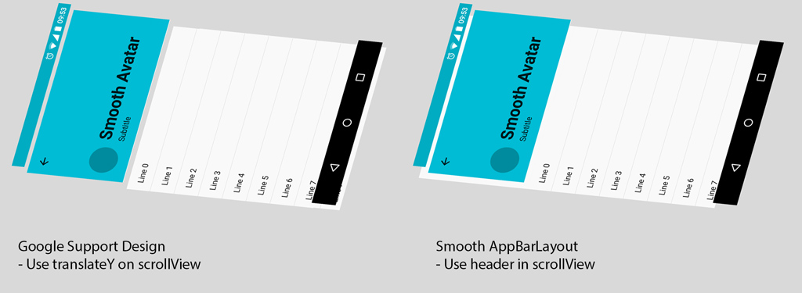
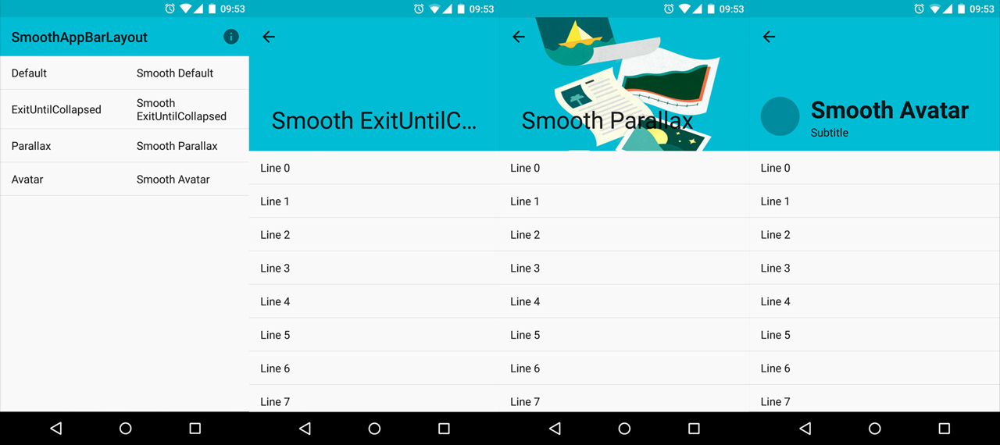

[  ](https://bintray.com/henrytao-me/maven/smooth-app-bar-layout/_latestVersion) [](http://android-arsenal.com/details/1/2565)

smooth-app-bar-layout
================

This is a smooth version of `Google Support Design AppBarLayout`. If you are using `AppBarLayout`, you will know it has an issue with fling. Check out these threads to know about that problem:
[http://stackoverflow.com/questions/30923889/flinging-with-recyclerview-appbarlayout](http://stackoverflow.com/questions/30923889/flinging-with-recyclerview-appbarlayout)
[https://code.google.com/p/android/issues/detail?id=177729...](https://code.google.com/p/android/issues/detail?id=177729&q=appbarlayout&colspec=ID%20Type%20Status%20Owner%20Summary%20Stars)

If you find that it still doesn't meet your need, don't hesitate to send me a request. I love to work with you to solve problems. [Send a request HERE](https://github.com/henrytao-me/smooth-app-bar-layout/issues)


## Installation

``` groovy
compile "me.henrytao:smooth-app-bar-layout:<latest-version>"
```

`smooth-app-bar-layout` is deployed to `jCenter`. Make sure you have `jcenter()` in your project gradle.


## Tested environments

- `"com.android.support:design:23.1.0"`
- `"com.android.support:appcompat-v7:23.1.0"`


## Demo

[](https://play.google.com/store/apps/details?id=me.henrytao.smoothappbarlayout)

Please note that the app on the Play store is not always the latest version.


## Concepts

 


## Features

- Default scrolling
- ExitUntilCollapsed
- Quick return
- Support SwipeRefreshLayout
- Support ViewPager
- Inbox App and Google Play App Detail samples
- SmoothViewPagerParallaxDrawerLayout and SmoothViewPagerDrawerLayout examples

If you want to add header to RecyclerView, checkout this RecyclerView WrapperAdapter [recyclerview-multistate-section-endless-adapter](https://github.com/henrytao-me/recyclerview-multistate-section-endless-adapter)


Checkout these demo videos:

- Google Design Support AppBarLayout: [https://youtu.be/oaN2UTZIRUk](https://youtu.be/oaN2UTZIRUk)
- SmoothAppBarLayout: [https://youtu.be/la6ixCL9RKs](https://youtu.be/la6ixCL9RKs)


 
 

 
## Usage

Super easy! Just need to do 3 steps:

- Change `android.support.design.widget.AppBarLayout` to `me.henrytao.smoothappbarlayout.SmoothAppBarLayout`.
- Remove `app:layout_behavior="@string/appbar_scrolling_view_behavior"`.
- Add header to your scroll view or recyclerView. **Or** set `paddingTop` and `clipToPadding="false"` to your `RecyclerView`, like this:

``` xml
<android.support.v7.widget.RecyclerView
    android:id="@android:id/list"
    android:layout_width="match_parent"
    android:layout_height="match_parent"
    android:clipToPadding="false"
    android:paddingTop="@dimen/header_height" />
```

#### Original AppBarLayout from Google Support Design

``` xml
<android.support.design.widget.CoordinatorLayout xmlns:android="http://schemas.android.com/apk/res/android"
  xmlns:app="http://schemas.android.com/apk/res-auto"
  android:layout_width="match_parent"
  android:layout_height="match_parent">

  <android.support.v7.widget.RecyclerView
    android:id="@android:id/list"
    android:layout_width="match_parent"
    android:layout_height="match_parent"
    app:layout_behavior="@string/appbar_scrolling_view_behavior" />

  <android.support.design.widget.AppBarLayout
    android:layout_width="match_parent"
    android:layout_height="@dimen/app_bar_height">

    <android.support.design.widget.CollapsingToolbarLayout
      android:id="@+id/collapsing_toolbar_layout"
      android:layout_width="match_parent"
      android:layout_height="match_parent"
      app:layout_scrollFlags="scroll|exitUntilCollapsed">

      <android.support.v7.widget.Toolbar
        android:id="@+id/toolbar"
        app:layout_collapseMode="pin"
        app:navigationIcon="@drawable/ic_toolbar_arrow_back"
        style="@style/AppStyle.MdToolbar" />
    </android.support.design.widget.CollapsingToolbarLayout>
  </android.support.design.widget.AppBarLayout>
</android.support.design.widget.CoordinatorLayout>
```

#### SmoothAppBarLayout 

``` xml
<android.support.design.widget.CoordinatorLayout xmlns:android="http://schemas.android.com/apk/res/android"
  xmlns:app="http://schemas.android.com/apk/res-auto"
  android:layout_width="match_parent"
  android:layout_height="match_parent">

  <android.support.v7.widget.RecyclerView
    android:id="@android:id/list"
    android:layout_width="match_parent"
    android:layout_height="match_parent" />

  <me.henrytao.smoothappbarlayout.SmoothAppBarLayout
    android:layout_width="match_parent"
    android:layout_height="@dimen/app_bar_height">

    <android.support.design.widget.CollapsingToolbarLayout
      android:id="@+id/collapsing_toolbar_layout"
      android:layout_width="match_parent"
      android:layout_height="match_parent"
      app:layout_scrollFlags="scroll|exitUntilCollapsed">

      <android.support.v7.widget.Toolbar
        android:id="@+id/toolbar"
        app:layout_collapseMode="pin"
        app:navigationIcon="@drawable/ic_toolbar_arrow_back"
        style="@style/AppStyle.MdToolbar" />
    </android.support.design.widget.CollapsingToolbarLayout>
  </me.henrytao.smoothappbarlayout.SmoothAppBarLayout>
</android.support.design.widget.CoordinatorLayout>
```

#### SmoothCollapsingToolbarLayout exmaple

``` xml
<android.support.design.widget.CoordinatorLayout xmlns:android="http://schemas.android.com/apk/res/android"
  xmlns:app="http://schemas.android.com/apk/res-auto"
  android:layout_width="match_parent"
  android:layout_height="match_parent">

  <android.support.v7.widget.RecyclerView
    android:id="@android:id/list"
    android:layout_width="match_parent"
    android:layout_height="match_parent" />

  <me.henrytao.smoothappbarlayout.SmoothAppBarLayout
    android:layout_width="match_parent"
    android:layout_height="@dimen/app_bar_height">

    <android.support.design.widget.CollapsingToolbarLayout
      android:id="@+id/collapsing_toolbar_layout"
      android:layout_width="match_parent"
      android:layout_height="match_parent"
      app:layout_scrollFlags="scroll|exitUntilCollapsed">

      <android.support.v7.widget.Toolbar
        android:id="@+id/toolbar"
        app:layout_collapseMode="pin"
        app:navigationIcon="@drawable/ic_toolbar_arrow_back"
        style="@style/AppStyle.MdToolbar" />

      <me.henrytao.smoothappbarlayout.SmoothCollapsingToolbarLayout
        android:layout_width="match_parent"
        android:layout_height="wrap_content"
        android:gravity="left|center_vertical"
        android:minHeight="?attr/actionBarSize"
        app:sctl_avatar_id="@+id/avatar"
        app:sctl_collapsed_avatarSize="?attr/mdIcon_sm"
        app:sctl_collapsed_offsetX="?attr/actionBarSize"
        app:sctl_collapsed_offsetY="0dp"
        app:sctl_collapsed_subtitleTextSize="14dp"
        app:sctl_collapsed_titleTextSize="16dp"
        app:sctl_expanded_avatarSize="?attr/mdIcon_lg"
        app:sctl_expanded_offsetX="?attr/mdLayout_spacing_md"
        app:sctl_expanded_offsetY="?attr/mdLayout_spacing_md"
        app:sctl_expanded_subtitleTextSize="16dp"
        app:sctl_expanded_titleTextSize="34dp"
        app:sctl_subtitle_id="@+id/subtitle"
        app:sctl_title_id="@+id/title">

        <ImageView
          android:id="@+id/avatar"
          android:layout_width="?attr/mdIcon_sm"
          android:layout_height="?attr/mdIcon_sm"
          android:layout_gravity="center_vertical"
          android:src="@drawable/ic_blank_circle" />

        <LinearLayout
          android:layout_width="wrap_content"
          android:layout_height="wrap_content"
          android:layout_gravity="center_vertical"
          android:layout_marginLeft="?attr/mdLayout_spacing_md"
          android:orientation="vertical">

          <TextView
            android:id="@+id/title"
            android:text="Title"
            style="@style/MdText.Title" />

          <TextView
            android:id="@+id/subtitle"
            android:text="Subtitle"
            style="@style/MdText.Body1" />
        </LinearLayout>
      </me.henrytao.smoothappbarlayout.SmoothCollapsingToolbarLayout>
    </android.support.design.widget.CollapsingToolbarLayout>
  </me.henrytao.smoothappbarlayout.SmoothAppBarLayout>
</android.support.design.widget.CoordinatorLayout>
```


## Contributing

Any contributions are welcome!  
Please check the [CONTRIBUTING](CONTRIBUTING.md) guideline before submitting a new issue. Wanna send PR? [Click HERE](https://github.com/henrytao-me/smooth-app-bar-layout/pulls)


## License

    Copyright 2015 "Henry Tao <hi@henrytao.me>"

    Licensed under the Apache License, Version 2.0 (the "License");
    you may not use this file except in compliance with the License.
    You may obtain a copy of the License at

        http://www.apache.org/licenses/LICENSE-2.0

    Unless required by applicable law or agreed to in writing, software
    distributed under the License is distributed on an "AS IS" BASIS,
    WITHOUT WARRANTIES OR CONDITIONS OF ANY KIND, either express or implied.
    See the License for the specific language governing permissions and
    limitations under the License.

